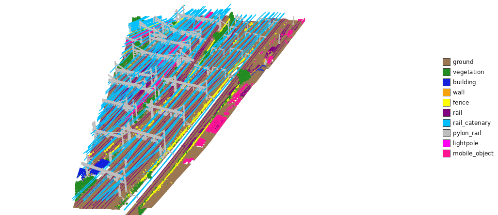
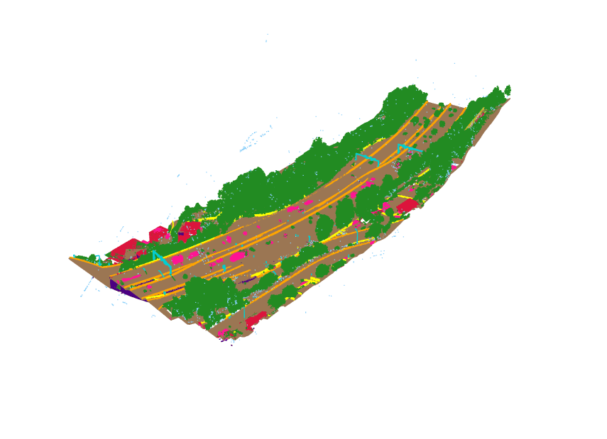
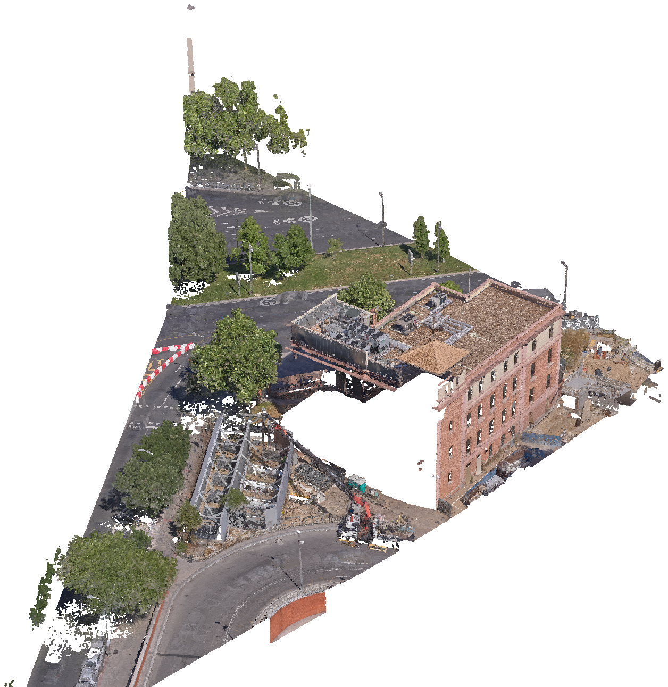
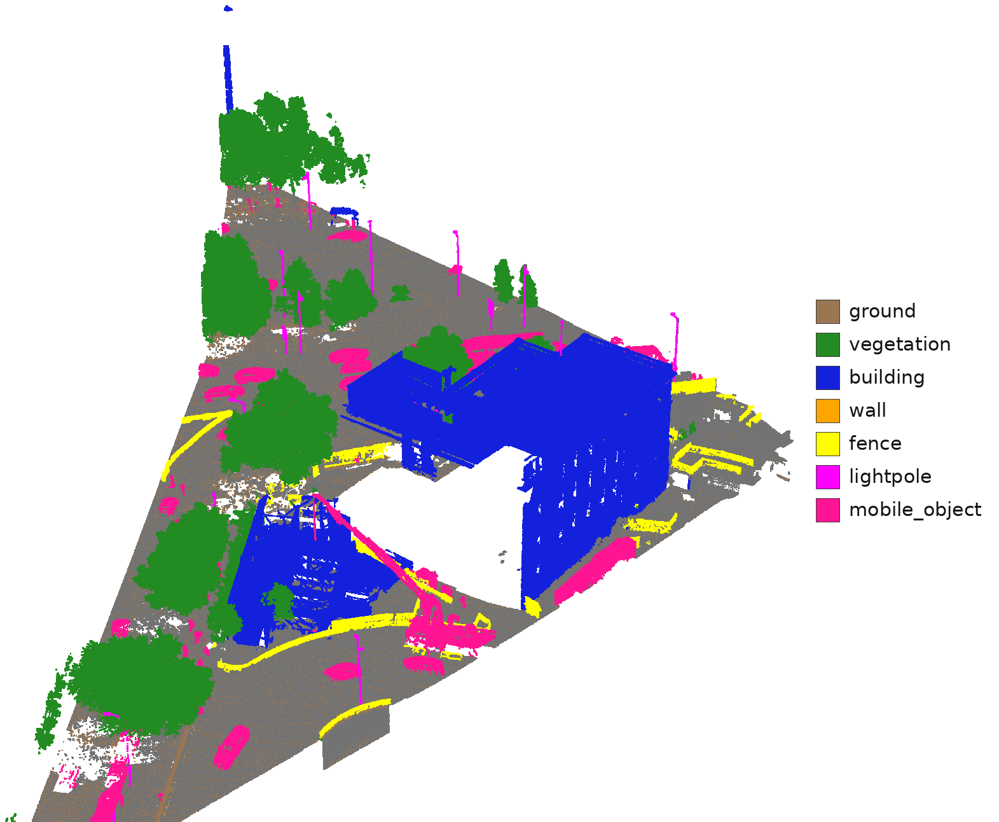
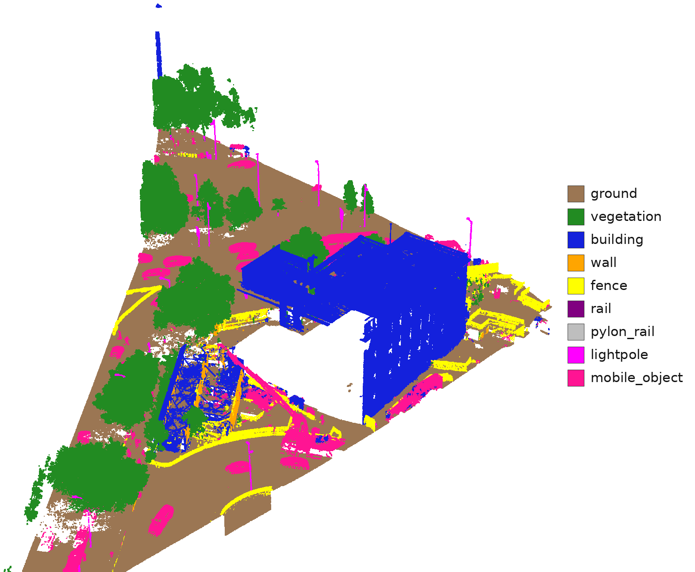

<h1 align="center">LiDAR Semantic Segmentation with Image Fusion</h1>


> **⚠️ Repository status**
>
> Parts of the codebase corresponding to ongoing research are intentionally
> omitted and will be released upon publication.

<p align="center">
  Point-cloud semantic segmentation with optional multi-view <b>camera–image fusion</b>,
  built on Point&nbsp;Transformer&nbsp;V3 and a family of lightweight fusion backbones
  that inject frozen <b>DINOv2/DINOv3</b> features into the 3D branch.
</p>

<!-- ─────────────────────────────  DEMO  ─────────────────────────────
     A GIF must use  (a <video> tag can't decode GIF, and GitHub's README
     sanitizer only embeds <video> for files uploaded as GitHub attachments,
     not repo-relative paths). GIFs autoplay + loop natively in . -->
<p align="center">
  
</p>

<p align="center">
  
</p>

<!-- <p align="center">
  <video src="figs/vids/A9CR_MSL_ALS_MN95_NF02_000034_pred.mp4" controls muted loop width="85%">
    Your browser can't play this video — open
    <a href="figs/vids/A9CR_MSL_ALS_MN95_NF02_000034_pred.mp4">figs/vids/demo.mp4</a>.
  </video>
</p> -->

<!-- Autoplaying alternative (works everywhere on GitHub):
<p align="center"></p>
-->

<p align="center"><i>360° turntable of a predicted A9CR aerial LiDAR scan — generated with <code>render_video.py</code> (see below).</i></p>

<p align="center">
  
  
  
</p>
<p align="center"><i>Same scan — raw RGB · ground truth · predicted classes.</i></p>

---

## Contents
- [What this is](#what-this-is)
- [Repository layout](#repository-layout)
- [Setup](#setup)
- [Data format](#data-format)
- [Preprocessing](#preprocessing)
- [Training](#training)
- [Testing & evaluation](#testing--evaluation)
- [Inference → predictions → reconstruction](#inference--predictions--reconstruction)
- [Visualization (LAS / PNG / video)](#visualization-las--png--video)
- [Configs & models](#configs--models)
- [Adding a new dataset](#adding-a-new-dataset)

---

## What this is

A research framework for **3D semantic segmentation of LiDAR point clouds**, with a
second **image branch** that fuses features from calibrated cameras into the 3D
backbone. Highlights:

- **Backbones** — Point Transformer V3 (`PT-v3-Base`), LitePT (`LitePT-v1`), and a
  `LitePT-Ditr-v2-*` family that projects LiDAR points into the images and fuses
  **frozen DINOv2/DINOv3** features at several decoder stages: `-G` (main model,
  ViT features + cross-attention/concat fusion), `-H` (ConvNeXt image encoder
  variant) and `-I` (decoder-head fusion variant).
- **Datasets** — A9CR & Atocha (aerial LiDAR + oblique/nadir cameras), GridNet-HD
  (power-line corridors), nuScenes (automotive), S3DIS (indoor).
- **Pipeline** — raw LAS → **chunked, voxel-quantized** tiles on disk → train / test →
  per-chunk predictions → **reconstruction** back to the original cloud → LAS / PNG /
  **360° video**.
- **Scale** — single-GPU or multi-GPU (`torchrun`); test-time augmentation (TTA) and
  **zone-aggregated, overlap-unbiased mIoU**.

The 3D input is voxel-quantized (points snapped to a regular grid, one representative
per cell) into a **sparse tensor**, processed by a submanifold sparse-conv stem and
serialized (z-order / Hilbert) attention stages.

## Repository layout

```
main.py                     # single entry point: train / --eval-only / --test-only / --profiling
configs/<dataset>/          # YAML configs (base.yaml + experiments, with _base_ inheritance)
datasets/                   # dataset classes (a9cr, atocha, gridnet, nuscenes, s3dis) + transforms
  preprocessing/            # raw LAS → chunks; reconstruction & visualization tools
engine/                     # trainer.py (Base/Segmentation/Distillation), tester.py (Base/SemSeg)
models/                     # segmentors (default.py, distiller.py) + backbones:
                            #   ptv3/, litept/, point_transformer_v3/  = plain 3D
                            #   litept_ditr_v2/                        = DINO-fusion family (G/H/I)
                            #   ditr_modified/, utonia/                = DITR-style baselines
losses/  metrics/           # loss & metric libraries
loggers/  scheduler/        # console/CSV/W&B loggers, LR schedulers
utils/                      # config/dist/optimizer/profiling; utils/viz3d.py = shared 3D-viz helpers
outputs/<dataset>/<run>/    # created at runtime: weights/, test_results/, metrics.txt, config.yaml
```

## Setup

Two environments are used, kept separate because Open3D and the GPU training stack
tend to conflict:

### 1) Training / testing env (GPU)

Use the provided container (see [`Dockerfile`](Dockerfile)) — it pins CUDA + spconv + the DINO deps or install into your own CUDA/PyTorch environment:

```bash
pip install -r requirements.txt
```
Needs a CUDA GPU (spconv sparse convolutions). Multi-view training downloads the DINO
backbone weights on first run.

### 2) Visualization / video env (CPU)

The reconstruction & rendering tools (`visualize_predictions.py`, `render_video.py`) are
**torch-free** and run in a small, separate Open3D env:

```bash
conda create -n open3d-video python=3.11 -y
conda activate open3d-video

conda install -c conda-forge numpy opencv -y
python -m pip install --upgrade pip

python -m pip install open3d laspy          # laspy = read/write the LAS point clouds
conda install -c conda-forge matplotlib imageio ffmpeg -y
```
Required for the viz tools: **numpy, open3d** (render / PLY / interactive), **laspy**
(`.las` export), **opencv** (mp4 / GIF frames), **Pillow** (GIF encoding — pulled in
automatically). `matplotlib` / `imageio` / `ffmpeg` are optional extras (matplotlib is
only needed by the dataset-statistics tool `utils/analyze_chunks.py`, which runs in the
training env above since it also imports torch).

## Data format

Every dataset is preprocessed into **per-chunk folders** (small spatial tiles). One
chunk:

```
<root>/<split>/<zone>/chunk_00042/
├── xyz.npy          (N,3) int16   # chunk-LOCAL coords in cm  → metres = xyz/100 + meta.origin
├── rgb.npy          (N,3) uint8   # per-point color
├── intensity.npy    (N,)  uint16  # LiDAR intensity
├── labels.npy       (N,)  uint8   # class ids (train/val; absent on blind test)
├── image_coord.npz  (N,C,2) int16 # pixel coords per camera; -1 = invisible  (image datasets)
├── orig_idx.npy     (N,)  int64   # row of each point in the original LAS (val/test only)
└── meta.json                      # origin, tile bbox, cam_names, n_las_pts
```

- `xyz.npy` stores **local** coordinates (relative to the chunk `origin` in `meta.json`)
  because absolute world coordinates (e.g. Swiss MN95) don't fit int16 — add
  `meta.origin` back to get global coordinates.
- `orig_idx` maps chunk points to the original LAS rows, so per-chunk predictions can be
  scattered back to the full cloud with no KD-tree matching.
- GridNet additionally has a `manifest.json` listing all chunks per split.
- Class names & colors live in each dataset file as a single editable list, e.g.
  [`datasets/a9cr.py`](datasets/a9cr.py):
  ```python
  CLASSES = [("ground", "#9b7653"), ("vegetation", "#228b22"), ...]  # (name, hex)
  ```

## Preprocessing

Raw LAS + cameras → chunks. Example for a Helimap dataset (A9CR / Atocha):

```bash
# 1) points → chunks (run per split: train / val / test)
python -m datasets.preprocessing.helimap.helimap_preprocess_points \
    --dataset a9cr --las-dir /data/A9CR/las --split-json splits.json \
    --split train --out-root /data/A9CR_preprocessed \
    --chunk-size 20 --stride 10 --voxel-size 0.05

# 2) project cameras onto the chunks (adds image_coord.npz + images/)
python -m datasets.preprocessing.helimap.helimap_preprocess_images \
    --out-root /data/A9CR_preprocessed --split train \
    --poses CAMERA_POS.xml --cal-front FRONT.xml --images-front /data/A9CR/front ...
```
GridNet uses `datasets.preprocessing.gridnet.gridnet_preprocess` (also does the image
projection in one pass). Points are **sanitized** (non-finite / far outliers dropped)
*before* `orig_idx` is written, so predictions always stay aligned with the
reconstruction back-pointers.

## Training

```bash
# single GPU
python main.py --config-file configs/a9cr/litept_ditr_v2_final_concat.yaml

# multi-GPU (batch_size in the config is the GLOBAL batch size)
torchrun --nproc_per_node=4 main.py --config-file configs/a9cr/litept_ditr_v2_final_concat.yaml
```
Outputs go to `outputs/<dataset>/<run_name>/`: `weights/best.pt` & `last.pt`, a frozen
`config.yaml`, CSV/W&B logs. Training **auto-resumes** from `last.pt` if interrupted.

Two trainers exist, selected by `trainer.type` in the config: `segmentation`
(the default — supervised training as above) and `distillation` (label-free
encoder pretraining: a `Distiller-Segmentor` model aligns LitePT encoder stages
with a frozen DINO teacher, and at the end of training an `encoder_only.pt` is
exported for transfer into a fusion backbone via `pretrained_backbone`).

## Testing & evaluation

```bash
# full test (uses the test block of the config: checkpoint, TTA, results_dir)
python main.py --test-only --config-file configs/a9cr/litept_ditr_v2_final_concat.yaml
# or torchrun --nproc_per_node=4 main.py --test-only --config-file ...

# quick validation-set metrics only
python main.py --eval-only --config-file configs/a9cr/litept_ditr_v2_final_concat.yaml
```
Testing runs TTA, writes **per-chunk predictions** to `test_results/<zone>/<chunk>.npy`,
and prints + saves per-class IoU / accuracy / precision to `metrics.txt`. For the
overlapping-chunk datasets it uses **zone-aggregated** scoring (each physical point
counted once → unbiased mIoU).

## Inference → predictions → reconstruction

The model architecture is defined entirely by the config `model` block, e.g.
[`configs/a9cr/litept_ditr_v2_final_concat.yaml`](configs/a9cr/litept_ditr_v2_final_concat.yaml):

```yaml
model:
  type: Point-Segmentor-GeoAux
  num_classes: 12
  backbone:
    type: LitePT-Ditr-v2-G      # 3D backbone + DINO image fusion
    in_channels: 6              # coord(3) + color(3)
    enc_channels: [36, 72, 144, 252, 504]
    dino_type: DinoV3
    dino_size: large            # frozen image encoder
    image_fusion_type: concat   # how DINO features enter the 3D decoder
    dino_fusion_layers: [-19, -13, -7, -1]
```

At test time each chunk yields a per-point prediction (`test_results/<zone>/<chunk>.npy`,
aligned 1:1 with the chunk's points). To go back to the **original cloud**:

```bash
# GridNet → leaderboard NPZ (one file per zone), reconstructed via orig_idx + majority vote
python -m datasets.preprocessing.gridnet.reconstruct_predictions split \
    --preprocessed-root /data/GridNet_preprocessed \
    --pred-dir outputs/gridnet/<run>/test_results \
    --out-dir  outputs/gridnet/<run>/npz --split test
```
For A9CR / Atocha the reconstruction is done directly by the visualization tools below
(they merge overlapping chunks back to the original LAS resolution).

## Visualization (LAS / PNG / video)

> Run these in the **`open3d-video`** env from [Setup](#setup) (`conda activate
> open3d-video`), not the training env.

Both tools reconstruct a whole zone and color it by prediction / ground truth / true
RGB / error / a specific confusion. General 3D-viz code is shared in
[`utils/viz3d.py`](utils/viz3d.py) so any dataset can reuse it.

```bash
# still image / LAS (open in CloudCompare) — predicted classes
python datasets/preprocessing/helimap/visualize_predictions.py \
    --dataset a9cr --preprocessed-root /data/A9CR_preprocessed --split test \
    --pred-dir outputs/a9cr/<run>/test_results --out-dir figs \
    --zone <ZONE> --color-by pred --render          # writes a PNG; --show for an interactive window

# highlight a specific mistake (e.g. vegetation predicted as airpoint)
... --color-by confusion --confusion vegetation airpoint

# 360° turntable video (the clip at the top of this README)
python datasets/preprocessing/helimap/render_video.py \
    --dataset a9cr --preprocessed-root /data/A9CR_preprocessed --split test \
    --pred-dir outputs/a9cr/<run>/test_results --out-dir figs/vids \
    --zone <ZONE> --color-by pred --voxel 0.2 --frames 240 --fps 30

# …or an autoplaying/looping GIF for the README banner (no ffmpeg needed):
python datasets/preprocessing/helimap/render_video.py ... \
    --zone <ZONE> --color-by pred --voxel 0.2 --frames 180 --fps 20 \
    --width 1280 --height 720 --gif --gif-scale 0.5
```
`--color-by` ∈ `pred | gt | rgb | error | confusion`. Exported LAS files also carry
`pred`/`gt`/`correct` scalar fields so you can recolor/filter in CloudCompare.

> **README banner:** GitHub embeds a committed `.mp4` via the `<video>` tag at the top;
> a `.gif` (from `--gif`) autoplays and loops — swap in the ``
> line. Keep GIFs small (fewer `--frames`, lower `--fps`, `--gif-scale ~0.5`; GitHub
> caps README images ~10 MB).

## Configs & models

Configs use `_base_` inheritance: `configs/<dataset>/base.yaml` holds the data block
(`data_root`, `num_classes`, `ignore_index`) and dataset type; each experiment sets
`run_name`, `model`, `training`, `val`, `test`. Registered model types:

| Kind | `type:` | Notes |
|---|---|---|
| Fusion backbones | `LitePT-Ditr-v2-G` / `-H` / `-I` | LitePT + frozen DINO features (main model / ConvNeXt image encoder / decoder-head fusion) |
| DITR-style baselines | `PT-v3m2-image`, `LitePT-v1-image`, `Utonia-Ditr-v2` | PTv3 / LitePT / Utonia backbones with DITR image fusion |
| Plain 3D baselines | `PT-v3-Base`, `LitePT-v1`, `LitePT-Ditr-v2` | geometry only, no cameras needed |
| Segmentor wrappers | `Base-Segmentor`(`-V2`), `Point-Segmentor-GeoAux`, `Distiller-Segmentor` | the `model.type` around a `backbone` block |

## Adding a new dataset

1. Add a dataset class in `datasets/` (subclass `DefaultDataset`; define `CLASSES` and a
   `get_data` returning `coord`/`color`/`segment`[/`image_*`]).
2. Add `configs/<name>/base.yaml` (+ an experiment config).
3. Reuse everything else — training, testing, and the whole
   [`utils/viz3d.py`](utils/viz3d.py) visualization stack (stills, LAS/PLY, interactive,
   video) work unchanged; you only provide the loader and the palette.
